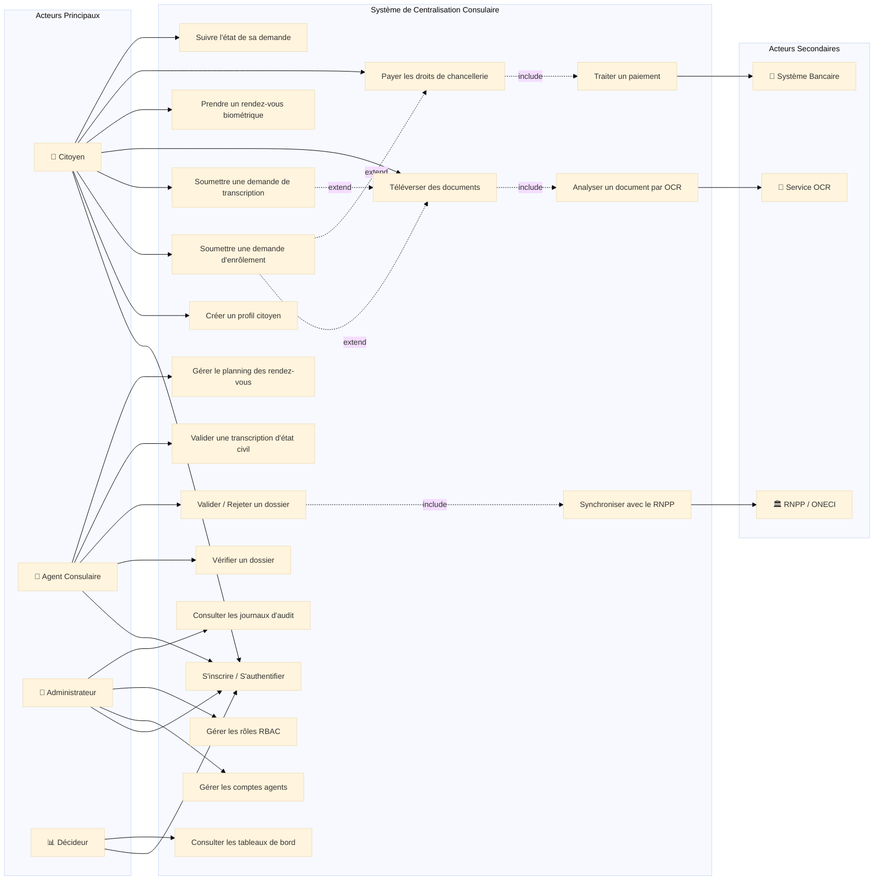

# Diagramme de Cas d'Utilisation (DCU)

Ce document présente le diagramme de cas d'utilisation du système de centralisation des données des ressortissants ivoiriens, conformément au Chapitre III (§I) du cours UML.

---

## 1. Identification des Acteurs

### Acteurs principaux (à l'initiative des interactions)

| Acteur | Type | Description |
| :--- | :--- | :--- |
| **Citoyen** | Personne physique | Ressortissant ivoirien de la diaspora qui utilise le portail pour s'enregistrer, soumettre des demandes, prendre rendez-vous et payer. |
| **Agent Consulaire** | Personne physique | Personnel de l'ambassade/consulat qui vérifie les dossiers, valide les documents et traite les rendez-vous biométriques. |
| **Administrateur** | Personne physique | Responsable technique qui gère les comptes, les rôles et consulte les journaux d'audit. |
| **Décideur** | Personne physique | Cadre du Ministère/ONECI qui consulte les tableaux de bord statistiques. |

### Acteurs secondaires (sollicités par le système)

| Acteur | Type | Description |
| :--- | :--- | :--- |
| **Système Bancaire** | Système externe | Passerelle de paiement sollicitée pour traiter les transactions financières (droits de chancellerie). |
| **RNPP/ONECI** | Système externe | Registre National des Personnes Physiques, interrogé pour vérifier/attribuer le NNI et synchroniser les données d'état civil. |
| **Service OCR** | Système externe | Module de reconnaissance optique de caractères pour l'analyse automatique des documents téléversés. |

### Généralisation entre acteurs

L'Agent Consulaire et l'Administrateur sont des spécialisations de l'acteur générique **Personnel Consulaire** (ils partagent l'authentification sécurisée au back-office).

---

## 2. Diagramme de Cas d'Utilisation

---

## 3. Relations entre Cas d'Utilisation

### Relations d'inclusion (`<<include>>`)
*   **Téléverser des documents** `<<include>>` **Analyser un document par OCR** : Chaque téléversement déclenche obligatoirement l'analyse OCR.
*   **Payer les droits de chancellerie** `<<include>>` **Traiter un paiement** : Le paiement en ligne nécessite obligatoirement l'appel au système bancaire.
*   **Valider / Rejeter un dossier** `<<include>>` **Synchroniser avec le RNPP** : Toute validation finale déclenche la synchronisation des données avec le registre national.

### Relations d'extension (`<<extend>>`)
*   **Soumettre une demande d'enrôlement** `<<extend>>` **Téléverser des documents** : Le citoyen *peut* ajouter des pièces justificatives lors de la soumission (optionnel à ce stade, il pourra les ajouter plus tard).
*   **Soumettre une demande d'enrôlement** `<<extend>>` **Payer les droits de chancellerie** : Le paiement peut être effectué au moment de la soumission ou ultérieurement.
*   **Soumettre une demande de transcription** `<<extend>>` **Téléverser des documents** : Idem pour les demandes de transcription.

### Relations de généralisation
*   **Agent Consulaire** et **Administrateur** héritent de **Personnel Consulaire** (authentification back-office commune).
*   **Soumettre une demande d'enrôlement** et **Soumettre une demande de transcription** sont des spécialisations du cas général **Soumettre une demande**.

---

## 4. Description Textuelle des Cas d'Utilisation Principaux

### 4.1 Cas d'utilisation : S'inscrire / S'authentifier

| Rubrique | Description |
| :--- | :--- |
| **Nom du cas** | S'inscrire / S'authentifier |
| **Objectif** | Permettre à un utilisateur de créer un compte ou de se connecter au système |
| **Acteurs** | Citoyen (principal), Agent Consulaire, Administrateur, Décideur |
| **Préconditions** | L'utilisateur dispose d'une adresse email valide |
| **Enchaînement nominal** | 1. L'utilisateur accède à la page de connexion. 2. Il saisit son email et son mot de passe. 3. Le système vérifie les identifiants. 4. L'utilisateur est redirigé vers son tableau de bord personnalisé selon son rôle. |
| **Enchaînements alternatifs** | (2a) Nouveau citoyen : il clique sur « S'inscrire », remplit le formulaire (email, mot de passe, confirmation). Le système crée le compte avec le rôle `CITOYEN`. (3a) Identifiants incorrects : le système affiche un message d'erreur et propose la réinitialisation du mot de passe. |
| **Post-conditions** | L'utilisateur est authentifié et sa session est active. Un log d'audit est créé. |
| **Contraintes non fonctionnelles** | Mot de passe haché (bcrypt). Protocole TLS 1.3. Session expirante après 30 min d'inactivité. |

---

### 4.2 Cas d'utilisation : Soumettre une demande d'enrôlement

| Rubrique | Description |
| :--- | :--- |
| **Nom du cas** | Soumettre une demande d'enrôlement |
| **Objectif** | Permettre au citoyen de remplir un formulaire d'enrôlement biographique en vue de l'attribution du NNI |
| **Acteurs** | Citoyen (principal), Service OCR (secondaire) |
| **Préconditions** | Le citoyen est authentifié. |
| **Enchaînement nominal** | 1. Le citoyen accède au module « Nouvelle demande ». 2. Il sélectionne le type « Enrôlement ». 3. Il saisit ses données d'état civil (nom, prénoms, date/lieu de naissance, genre, adresse, téléphone). 4. Il peut téléverser des documents justificatifs (passeport, acte de naissance). 5. Le système lance l'OCR sur chaque document téléversé `<<include>>`. 6. Le citoyen vérifie et corrige les données pré-remplies par l'OCR. 7. Le citoyen enregistre la demande en mode « Brouillon » ou la soumet directement. 8. Le système attribue le statut `SOUMIS` et notifie le citoyen par email. |
| **Enchaînements alternatifs** | (4a) Le citoyen ne dispose pas des documents : il enregistre en brouillon et les téléverse ultérieurement. (5a) L'OCR échoue : le citoyen saisit manuellement les informations. (7a) Le citoyen souhaite payer immédiatement `<<extend>>` → le cas « Payer les droits de chancellerie » est déclenché. |
| **Post-conditions** | La demande est créée avec statut `BROUILLON` ou `SOUMIS`. Le citoyen est associé à la demande. Un log d'audit est enregistré. |
| **Contraintes non fonctionnelles** | Les données biographiques ne sont jamais stockées en cache local. Chiffrement en transit (TLS 1.3). |

---

### 4.3 Cas d'utilisation : Valider / Rejeter un dossier

| Rubrique | Description |
| :--- | :--- |
| **Nom du cas** | Valider / Rejeter un dossier |
| **Objectif** | Permettre à l'agent consulaire de vérifier et statuer sur une demande |
| **Acteurs** | Agent Consulaire (principal), RNPP/ONECI (secondaire) |
| **Préconditions** | L'agent est authentifié avec le rôle `AGENT`. La demande a le statut `SOUMIS` ou `EN_COURS`. |
| **Enchaînement nominal** | 1. L'agent accède à la liste des dossiers en attente. 2. Il sélectionne un dossier et consulte les données biographiques et les documents téléversés. 3. Il vérifie la conformité de chaque document (comparaison OCR vs. original si nécessaire). 4. Il valide chaque document individuellement (`VALIDE` / `REFUSE`). 5. Si tous les documents sont validés, l'agent approuve le dossier. 6. Le système change le statut de la demande en `VALIDE`. 7. Le système synchronise les données avec le RNPP `<<include>>`. 8. Le citoyen est notifié par email de la validation. |
| **Enchaînements alternatifs** | (4a) Un ou plusieurs documents sont refusés : l'agent saisit un motif de rejet pour chaque document refusé. (5a) L'agent rejette le dossier : il saisit le motif global de rejet, le statut passe à `REJETE`, le citoyen est notifié avec le motif. |
| **Post-conditions** | La demande a le statut `VALIDE` ou `REJETE`. Un log d'audit détaille l'action de l'agent (IP, horodatage, motif). Les données validées sont synchronisées avec le RNPP. |
| **Contraintes non fonctionnelles** | Traçabilité totale (RBAC + journaux d'audit immuables). Conformité Loi 2013-450. |

---

### 4.4 Cas d'utilisation : Payer les droits de chancellerie

| Rubrique | Description |
| :--- | :--- |
| **Nom du cas** | Payer les droits de chancellerie |
| **Objectif** | Permettre au citoyen de régler les frais liés à sa demande via paiement en ligne |
| **Acteurs** | Citoyen (principal), Système Bancaire (secondaire) |
| **Préconditions** | Le citoyen est authentifié. Une demande est associée au paiement. |
| **Enchaînement nominal** | 1. Le citoyen accède au module de paiement. 2. Le système affiche le montant dû et les moyens de paiement disponibles (Carte bancaire, Mobile Money). 3. Le citoyen sélectionne son moyen de paiement et saisit les informations requises. 4. Le système transmet la demande au Système Bancaire `<<include>>`. 5. Le Système Bancaire traite la transaction et retourne un statut (`REUSSI` / `ECHOUE`). 6. Le système enregistre le paiement avec la référence de transaction. 7. Le citoyen reçoit une confirmation par email. |
| **Enchaînements alternatifs** | (5a) Transaction échouée : le système enregistre le paiement avec statut `ECHOUE`, le citoyen est invité à réessayer. (3a) Le citoyen annule : il retourne à sa demande sans paiement. |
| **Post-conditions** | Le paiement est enregistré avec statut `REUSSI` ou `ECHOUE`. La référence de transaction est unique et immuable. Un reçu électronique est généré. |
| **Contraintes non fonctionnelles** | Protocole PCI-DSS pour les données de carte. Aucune donnée bancaire stockée localement. |
