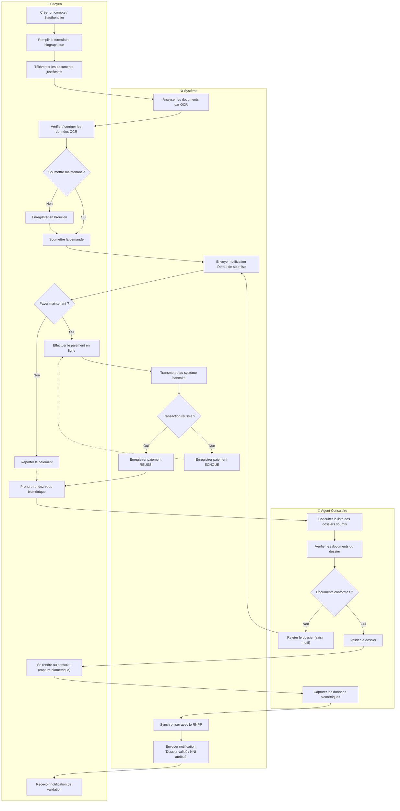
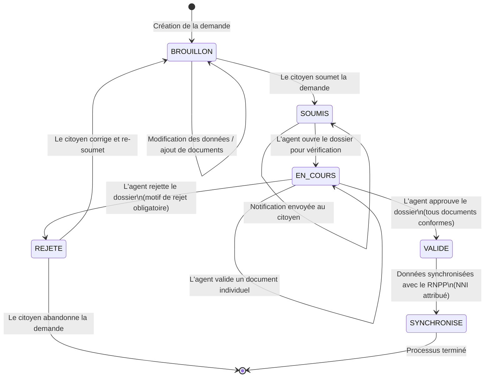
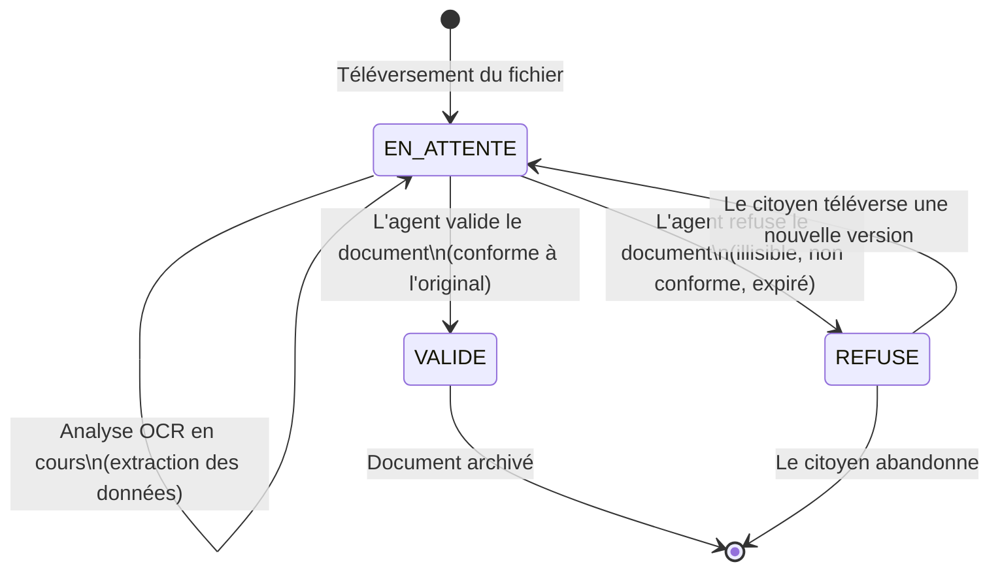

# Diagrammes Comportementaux Complémentaires

Ce document contient les diagrammes d'activité et d'état-transition, conformément aux Chapitres III (§III et §V) du cours UML.

---

## 1. Diagramme d'Activité (DAC) — Processus Consulaire Complet

Ce diagramme représente le flux de travail global du processus d'enrôlement consulaire, depuis la soumission de la demande par le citoyen jusqu'à la synchronisation finale avec le RNPP. Les **couloirs d'activités** (swimlanes, p.63-64 du cours UML) sont utilisés pour montrer la responsabilité de chaque acteur.

### Lecture du diagramme d'activité

1. **Phase Citoyen** : Le citoyen s'inscrit, remplit ses données biographiques, téléverse ses documents (OCR automatique), puis choisit de soumettre immédiatement ou de sauvegarder en brouillon.
2. **Phase Paiement** : Après soumission, le citoyen peut payer en ligne (via le système bancaire) ou reporter le paiement.
3. **Phase Agent** : L'agent consulaire consulte les dossiers soumis, vérifie les documents, et décide de valider ou rejeter le dossier.
4. **Phase Biométrique** : Si le dossier est validé, le citoyen se rend physiquement au consulat pour la capture biométrique.
5. **Phase Finale** : Les données sont synchronisées avec le RNPP, un NNI est attribué, et le citoyen est notifié.

---

## 2. Diagramme d'État-Transition (DET) — Cycle de vie de l'objet Demande

Ce diagramme modélise les **états successifs** d'un objet `Demande` et les **événements déclencheurs** de chaque transition, conformément au Chapitre III (§III, p.57-59) du cours UML.

### Description des états

| État | Description | Actions internes (activités) |
| :--- | :--- | :--- |
| **BROUILLON** | Demande créée mais non encore soumise. Le citoyen peut modifier ses données et ajouter/retirer des documents. | `do/ sauvegarderDonnées()` |
| **SOUMIS** | Demande transmise pour traitement. Le citoyen ne peut plus la modifier directement. | `entry/ envoyerNotification("Demande soumise")` |
| **EN_COURS** | Un agent consulaire examine le dossier et vérifie les documents un par un. | `do/ vérifierDocuments()` |
| **VALIDE** | Tous les documents sont conformes et le dossier est approuvé par l'agent. | `entry/ enregistrerLogAudit("APPROBATION")` |
| **REJETE** | Le dossier ne satisfait pas aux exigences. Un motif de rejet est obligatoirement renseigné. | `entry/ envoyerNotification("Dossier rejeté", motif)` |
| **SYNCHRONISE** | Les données d'état civil ont été transmises au RNPP et un NNI a été attribué. État terminal. | `entry/ synchroniserRNPP()`, `entry/ envoyerNotification("NNI attribué")` |

### Description des transitions

| Transition | Événement déclencheur | Garde (condition) | Action |
| :--- | :--- | :--- | :--- |
| BROUILLON → SOUMIS | `soumettre()` | Données biographiques complètes | `changerStatut("SOUMIS")` |
| SOUMIS → EN_COURS | `ouvrirDossier(agent_id)` | Agent authentifié avec rôle `AGENT` | `changerStatut("EN_COURS")` |
| EN_COURS → VALIDE | `valider()` | Tous les documents ont `statut_validation = "VALIDE"` | `changerStatut("VALIDE")` |
| EN_COURS → REJETE | `rejeter(motif)` | `motif` non vide | `changerStatut("REJETE")`, `setMotifRejet(motif)` |
| REJETE → BROUILLON | `corriger()` | Le citoyen modifie ses données | `changerStatut("BROUILLON")`, `resetMotifRejet()` |
| VALIDE → SYNCHRONISE | `synchroniserRNPP()` | Connexion au RNPP active | `attribuerNNI(nni)` |

---

## 3. Diagramme d'État-Transition — Cycle de vie de l'objet Document

