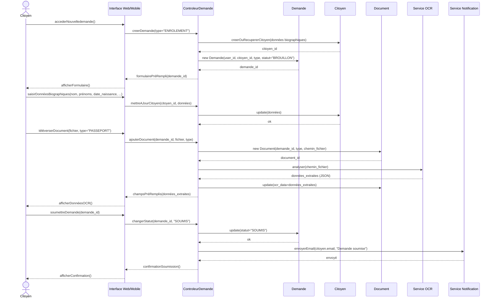
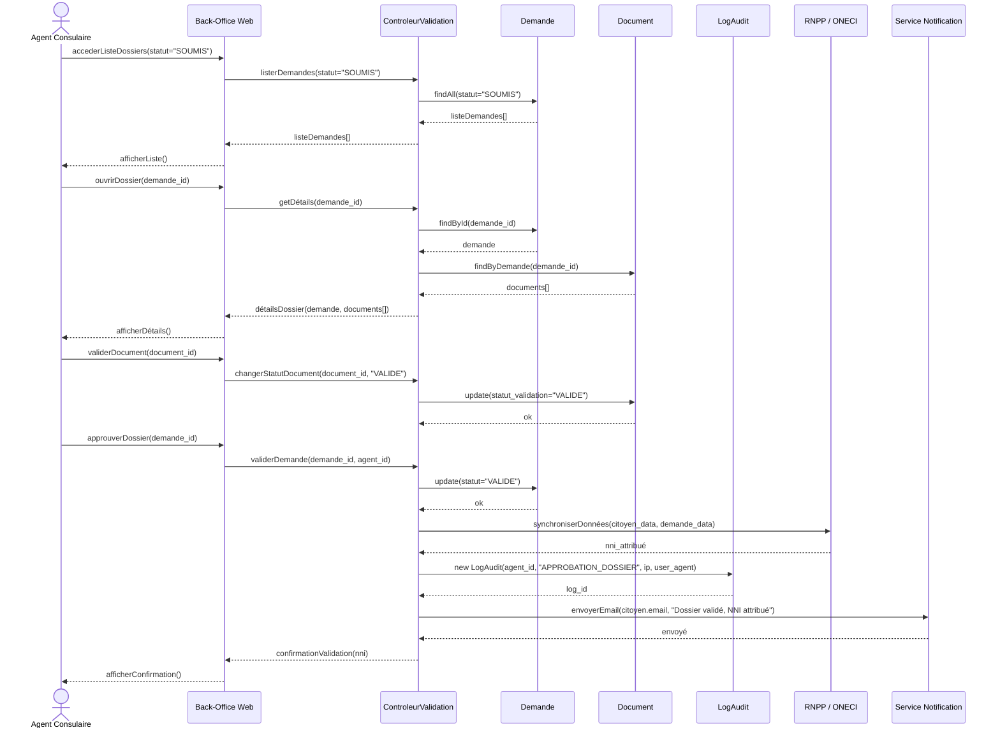
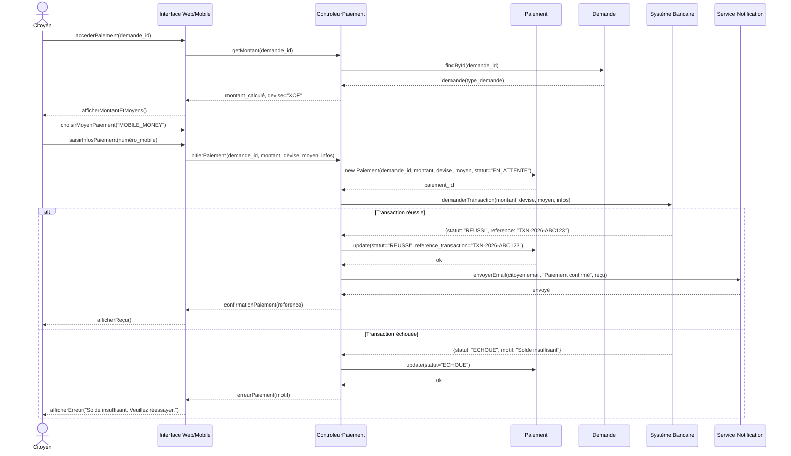

# Diagrammes de Séquence (DSE)

Ce document présente les diagrammes de séquence des scénarios principaux du système, conformément au Chapitre III (§II) du cours UML. Chaque diagramme illustre les interactions chronologiques entre les acteurs, les objets frontières (interfaces), les objets de contrôle et les objets entités.

---

## 1. Scénario : Soumettre une demande d'enrôlement

Ce diagramme décrit l'enchaînement nominal du cas d'utilisation « Soumettre une demande d'enrôlement ».

---

## 2. Scénario : Valider un dossier par l'Agent Consulaire

Ce diagramme décrit le scénario nominal de validation d'un dossier, incluant la synchronisation avec le RNPP.

---

## 3. Scénario : Payer les droits de chancellerie

Ce diagramme illustre le flux de paiement en ligne, incluant l'interaction avec le système bancaire externe.

---

## 4. Correspondance Messages / Opérations du Diagramme de Classes

Conformément au cours UML (Chap. III §II.6, p.51), les messages synchrones correspondent à des opérations dans le diagramme de classes. Voici la correspondance :

| Message du diagramme de séquence | Classe propriétaire | Opération correspondante |
| :--- | :--- | :--- |
| `creerDemande(type)` | ControleurDemande | `+creerDemande(type: string): Demande` |
| `creerOuRecupererCitoyen(données)` | Citoyen | `+creerOuRecuperer(données: dict): Citoyen` |
| `ajouterDocument(demande_id, fichier, type)` | ControleurDemande | `+ajouterDocument(demandeId: UUID, fichier: File, type: string): Document` |
| `analyser(chemin_fichier)` | ServiceOCR | `+analyser(chemin: string): JSON` |
| `changerStatut(demande_id, statut)` | Demande | `+changerStatut(statut: string): void` |
| `validerDemande(demande_id, agent_id)` | ControleurValidation | `+validerDemande(demandeId: UUID, agentId: UUID): void` |
| `synchroniserDonnées(citoyen_data, demande_data)` | InterfaceRNPP | `+synchroniser(citoyen: Citoyen, demande: Demande): string` |
| `initierPaiement(demande_id, montant, devise, moyen, infos)` | ControleurPaiement | `+initierPaiement(demandeId: UUID, montant: Decimal, ...): Paiement` |
| `demanderTransaction(montant, devise, moyen, infos)` | InterfaceBancaire | `+demanderTransaction(montant: Decimal, ...): TransactionResult` |
