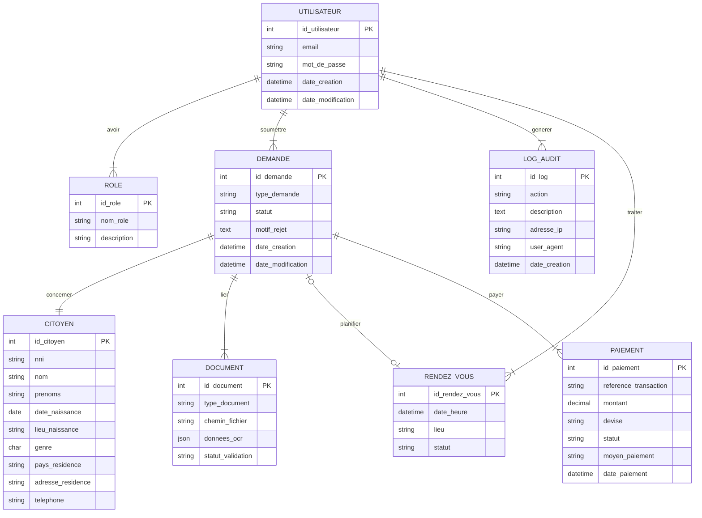
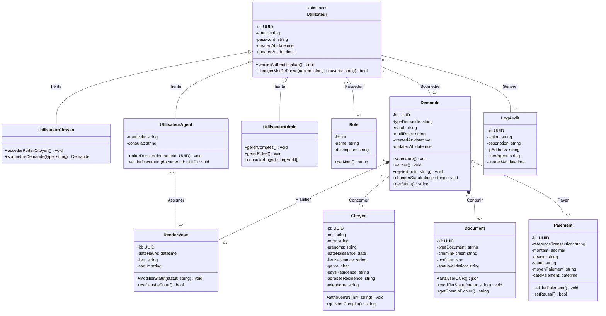

# Modèle Conceptuel des Données (MCD) & Diagramme UML

Ce document présente la modélisation conceptuelle des données du système de centralisation des ressortissants ivoiriens. Il comprend la définition Merise des entités et des associations, le schéma Entité-Association (ERD), ainsi que le diagramme de classes UML équivalent.

---

## 1. Modélisation Conceptuelle (Méthode Merise)

### 1.1 Liste des Entités et Attributs

1.  **UTILISATEUR** : Représente le compte de connexion d'un citoyen ou d'un membre du personnel consulaire.
    *   *id_utilisateur* (Identifiant)
    *   email
    *   mot_de_passe
    *   date_creation
    *   date_modification

2.  **ROLE** : Rôle d'accès système pour la gestion RBAC.
    *   *id_role* (Identifiant)
    *   nom_role (ex: `'ADMIN'`, `'AGENT'`, `'CITOYEN'`)
    *   description

3.  **CITOYEN** : Représente l'identité physique du ressortissant.
    *   *id_citoyen* (Identifiant)
    *   nni (Numéro National d'Identification)
    *   nom
    *   prenoms
    *   date_naissance
    *   lieu_naissance
    *   genre
    *   pays_residence
    *   adresse_residence
    *   telephone

4.  **DEMANDE** : Dossier d'état civil ou d'enrôlement.
    *   *id_demande* (Identifiant)
    *   type_demande (ex: `'ENROLEMENT'`, `'TRANSCRIPTION_NAISSANCE'`)
    *   statut
    *   motif_rejet
    *   date_creation
    *   date_modification

5.  **DOCUMENT** : Pièce justificative numérisée rattachée à une demande.
    *   *id_document* (Identifiant)
    *   type_document
    *   chemin_fichier
    *   donnees_ocr
    *   statut_validation

6.  **RENDEZ_VOUS** : Plage horaire d'enrôlement biométrique consulaire.
    *   *id_rendez_vous* (Identifiant)
    *   date_heure
    *   lieu
    *   statut

7.  **PAIEMENT** : Preuve financière liée au traitement d'un dossier.
    *   *id_paiement* (Identifiant)
    *   reference_transaction
    *   montant
    *   devise
    *   statut
    *   moyen_paiement
    *   date_paiement

8.  **LOG_AUDIT** : Journal d'audit pour la sécurité des accès.
    *   *id_log* (Identifiant)
    *   action
    *   description
    *   adresse_ip
    *   user_agent
    *   date_creation

### 1.2 Liste des Associations et Cardinalités

*   **Avoir_Role** (UTILISATEUR <-> ROLE)
    *   `UTILISATEUR (1,N) - Avoir_Role - (1,N) ROLE`
    *   *Règle de gestion :* Un utilisateur possède au moins un rôle et peut en avoir plusieurs. Un rôle peut être attribué à plusieurs utilisateurs.
*   **Soumettre** (UTILISATEUR <-> DEMANDE)
    *   `UTILISATEUR (0,N) - Soumettre - (1,1) DEMANDE`
    *   *Règle de gestion :* Un utilisateur peut soumettre 0 ou plusieurs demandes. Une demande est soumise par un et un seul utilisateur.
*   **Concerner** (DEMANDE <-> CITOYEN)
    *   `DEMANDE (1,1) - Concerner - (0,N) CITOYEN`
    *   *Règle de gestion :* Une demande concerne exactement un citoyen (existant ou en cours de création). Un citoyen peut être concerné par 0 ou plusieurs demandes au cours de sa vie (ex: enrôlement initial, transcription de mariage, etc.).
*   **Lier_Document** (DEMANDE <-> DOCUMENT)
    *   `DEMANDE (0,N) - Lier_Document - (1,1) DOCUMENT`
    *   *Règle de gestion :* Une demande peut être étayée par 0 ou plusieurs documents justificatifs. Un document téléversé est obligatoirement lié à une et une seule demande.
*   **Planifier** (DEMANDE <-> RENDEZ_VOUS)
    *   `DEMANDE (0,1) - Planifier - (1,1) RENDEZ_VOUS`
    *   *Règle de gestion :* Une demande peut faire l'objet de 0 ou 1 rendez-vous physique de capture biométrique. Un rendez-vous est obligatoirement fixé pour une et une seule demande.
*   **Assigner_Agent** (RENDEZ_VOUS <-> UTILISATEUR)
    *   `RENDEZ_VOUS (0,1) - Assigner_Agent - (0,N) UTILISATEUR`
    *   *Règle de gestion :* Un rendez-vous peut être affecté à 0 ou 1 agent consulaire (utilisateur avec rôle `AGENT`). Un agent peut se voir attribuer 0 à plusieurs rendez-vous.
*   **Payer** (DEMANDE <-> PAIEMENT)
    *   `DEMANDE (0,N) - Payer - (1,1) PAIEMENT`
    *   *Règle de gestion :* Une demande peut faire l'objet de 0 à plusieurs tentatives de paiement (si des échecs surviennent). Un paiement enregistré correspond à une et une seule demande.
*   **Generer_Log** (UTILISATEUR <-> LOG_AUDIT)
    *   `UTILISATEUR (0,N) - Generer_Log - (0,1) LOG_AUDIT`
    *   *Règle de gestion :* Un utilisateur peut générer plusieurs logs d'audit. Un log d'audit peut être associé à 0 ou 1 utilisateur (il est anonyme si l'action a lieu hors session).

---

## 2. Schéma Entité-Relation (MCD Graphique)

Voici la représentation sous forme de diagramme d'entités-relations Mermaid :

---

## 3. Diagramme de Classes UML (Modèle Statique)

Ce diagramme corrigé respecte les conventions du cours UML :
*   **Visibilité** (Chap. II §2, p.24) : attributs en `-` (privé), opérations en `+` (public), héritées en `#` (protégé).
*   **Composition** (Chap. II §4, p.30-32) : losange plein `◆` pour les relations où la suppression du composé entraîne la suppression des composants (Demande → Document, Demande → RendezVous).
*   **Généralisation/Spécialisation** (Chap. II §6, p.34-36) : hiérarchie d'héritage entre `Utilisateur` (super-classe abstraite) et ses sous-classes (`UtilisateurCitoyen`, `UtilisateurAgent`, `UtilisateurAdmin`).
*   **Agrégation** (Chap. II §4, p.29) : losange vide `◇` pour la relation Demande → Paiement (un paiement peut exister indépendamment si archivé).

### Légende des relations UML

| Symbole | Type de relation | Signification | Exemple |
| :---: | :--- | :--- | :--- |
| `──` | Association | Lien sémantique entre deux classes | Utilisateur ── Demande |
| `◆──` (`*--`) | **Composition** | La suppression du composé entraîne la suppression des composants | Demande ◆── Document |
| `◇──` (`o--`) | **Agrégation** | Le composant peut exister indépendamment du composé | Demande ◇── Paiement |
| `◁──` (`<\|--`) | **Généralisation** | Héritage : la sous-classe hérite des attributs et opérations de la super-classe | Utilisateur ◁── UtilisateurCitoyen |

